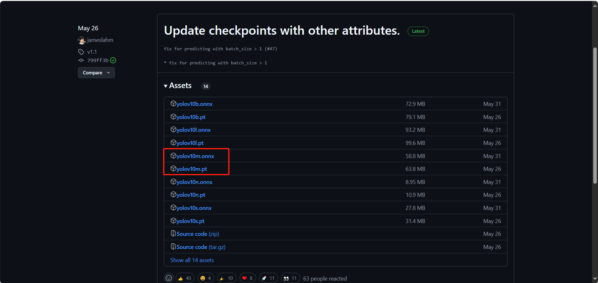
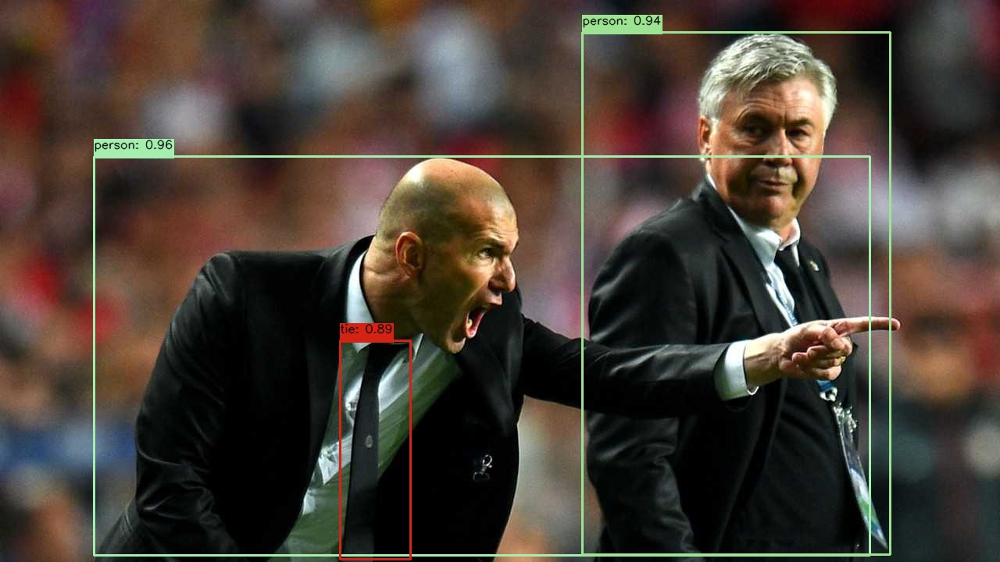
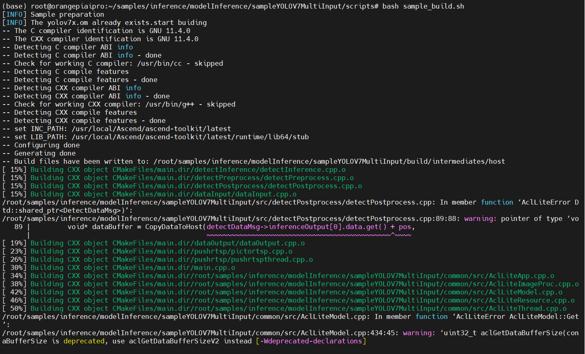

项目链接：https://gitee.com/aspartamej/yolov10_om_infer

## 0. 准备工作

### 0.0. 安装128G固态硬盘并烧录镜像

需要先将镜像烧录到 TF 卡上，再登录开发板，将镜像烧录到 SATA SSD 中，详细过程参考用户手册

[参考用户手册 > OrangePi_AI_Pro_昇腾_用户手册_v0.8.pdf > 开发板使用介绍 > 烧写 Linux 镜像到 SATA SSD 中的方](http://www.orangepi.cn/html/hardWare/computerAndMicrocontrollers/service-and-support/Orange-Pi-AIpro.html)


### 0.1. 更新固件并超频CPU和AI算力

1. 将固件上传到OPi AI Pro开发板的Linux系统中

    [Ascend310B-firmware-7.3.t10.0.b528-rc-signed-opiaipro-12t-1.6ghz-20240605.run下载地址和更新方法（官方工具>Ascend310B-firmware固件包）](http://www.orangepi.cn/html/hardWare/computerAndMicrocontrollers/service-and-support/Orange-Pi-AIpro.html)

2. 添加执行权限

    ```bash
    chmod +x Ascend310B-firmware-7.3.t10.0.b528-rc-signed-opiaipro-12t-1.6ghz-20240605.run
    ```

3. 更新固件

    ```bash
    ./Ascend310B-firmware-7.3.t10.0.b528-rc-signed-opiaipro-12t-1.6ghz-20240605.run --full
    ```

4. 断电重启系统后使用下面的命令切换到12T的AI算力档位

    ```bash
    npu-smi set -t nve-level -i 0 -c 0 -d 1
    ```

8. 然后重启系统，如果使用下面的命令能看到aicore freq变为了750，说明切换到了12T的AI算力

    ```bash
    grep "aicore freq" /var/log/npu/slog/device-0/device-0*
    ```

    

### 0.2. 升级toolkit和kernels

1. 下载toolkit和kernels

    [Ascend-cann-toolkit_8.0.RC2_linux-aarch64.run和Ascend-cann-kernels-310b_8.0.RC2_linux.run下载链接](https://www.hiascend.com/developer/download/community/result?module=cann&cann=8.0.RC2.beta1)

2. 卸载旧的toolkit和kernels

    执行/usr/local/Ascend/ascend-toolkit/cann_uninstall.sh脚本，并删除/usr/local/Ascend/ascend-toolkit目录

3. 赋予安装包执行权限并安装

    ```bash
    chmod +x Ascend-cann-toolkit_8.0.RC2_linux-aarch64.run
    chmod +x Ascend-cann-kernels-310b_8.0.RC2_linux.run
    ./Ascend-cann-toolkit_8.0.RC2_linux-aarch64.run --install --install-for-all --quiet
    ./Ascend-cann-kernels-310b_8.0.RC2_linux.run --install --install-for-all --quiet
    ```

4. 设置环境变量

    ```bash
    echo 'source /usr/local/Ascend/ascend-toolkit/set_env.sh' >> ~/.bashrc
    source ~/.bashrc
    ```

### 0.3. 将4个CPU都设置为Control CPU

在编译安装软件包还有模型转换时发现只有3个CPU在使用，有1个CPU一直处于空闲状态，因此需要将4个CPU都设置为Control CPU，充分使用CPU算力

[参考用户手册 > OrangePi_AI_Pro_昇腾_用户手册_v0.8.pdf > Ubuntu Xfce 桌面系统使 > AI CPU 和 control CPU 的设置方法](http://www.orangepi.cn/html/hardWare/computerAndMicrocontrollers/service-and-support/Orange-Pi-AIpro.html)

1. 以将4个CPU都设置为control CPU并重启系统

    ```bash
    npu-smi set -t cpu-num-cfg -i 0 -c 0 -v 0:4:0
    reboot
    ```

2. 查看control CPU和AI CPU的分配数量，确定配置生效

    ```bash
    npu-smi info -t cpu-num-cfg -i 0 -c 0
    ```

    

### 0.4. 设置swap内存

在进行atc模型转换时，会因为内存不足而失败。有两种解决方案，一种是通过设置环境变量**TE_PARALLEL_COMPILER=1**和**MAX_COMPILE_CORE_NUMBER=1**限制进程数，另一种是设置swap内存。为了尽量提高效率，这里我选择设置swap内存。

[参考用户手册 > OrangePi_AI_Pro_昇腾_用户手册_v0.8.pdf > Ubuntu Xfce 桌面系统使 > 设置 Swap 内存的方法](http://www.orangepi.cn/html/hardWare/computerAndMicrocontrollers/service-and-support/Orange-Pi-AIpro.html)

1. 创建swap文件

    ```bash
    fallocate -l 32G /swapfile
    ```

2. 修改文件权限

    ```bash
    chmod 600 /swapfile
    ```

3. 设置成swap空间

    ```bash
    mkswap /swapfile
    ```

4. 启用swap

    ```bash
    swapon /swapfile
    ```

5. 开机自启用

    ```bash
    echo '/swapfile none swap sw 0 0' | tee -a /etc/fstab
    ```

6. 查看swap状态

    ```bash
    free -h
    ```

    

## 1. 基于onnxruntime的模型推理

### 1.1. 准备onnx模型

可直接下载onnx模型文件，或者下载pth权重文件，然后使用ultralytics转换为onnx模型文件

权重下载链接：https://github.com/THU-MIG/yolov10/releases

- 下载onnx模型文件或pth权重文件


- （可选）pth权重文件转onnx模型文件

    安装ultricytics（略），导出onnx模型文件

    ```
    yolo export model=yolov10m.pt format=onnx opset=11 simplify
    ```
    

### 1.2. yolov10预处理和后处理

yolov10预处理在yolov10/ultralytics/engine/predictor.py文件中

包含以下步骤：
1. self.pre_transform：即 letterbox 添加灰条
2. im[…,::-1]：BGR → RGB
3. transpose((0, 3, 1, 2))：添加 batch 维度，HWC -> CHW
4. torch.from_numpy：numpy转tensor
5. im /= 255：除以 255，归一化

letterbox类主要就是对图像的宽高进行同比例缩放，在四周添加灰条，并记录缩放比率和灰条的宽高用于后处理的复原，这里我保留letterbox类的核心功能，改写为单个函数；其它涉及torch的部分用opencv和numpy替代

```python
def letterbox(img, new_shape=(640, 640), auto=False, scaleFill=False, scaleup=True, center=True, stride=32):
        # Resize and pad image while meeting stride-multiple constraints
        shape = img.shape[:2]  # current shape [height, width]
        if isinstance(new_shape, int):
            new_shape = (new_shape, new_shape)

        # Scale ratio (new / old)
        r = min(new_shape[0] / shape[0], new_shape[1] / shape[1])
        if not scaleup:  # only scale down, do not scale up (for better val mAP)
            r = min(r, 1.0)

        # Compute padding
        ratio = r, r  # width, height ratios
        new_unpad = int(round(shape[1] * r)), int(round(shape[0] * r))
        dw, dh = new_shape[1] - new_unpad[0], new_shape[0] - new_unpad[1]  # wh padding
        if auto:  # minimum rectangle
            dw, dh = np.mod(dw, stride), np.mod(dh, stride)  # wh padding
        elif scaleFill:  # stretch
            dw, dh = 0.0, 0.0
            new_unpad = (new_shape[1], new_shape[0])
            ratio = new_shape[1] / shape[1], new_shape[0] / shape[0]  # width, height ratios

        if center:
            dw /= 2  # divide padding into 2 sides
            dh /= 2

        if shape[::-1] != new_unpad:  # resize
            img = cv2.resize(img, new_unpad, interpolation=cv2.INTER_LINEAR)
        top, bottom = int(round(dh - 0.1)) if center else 0, int(round(dh + 0.1))
        left, right = int(round(dw - 0.1)) if center else 0, int(round(dw + 0.1))
        img = cv2.copyMakeBorder(
            img, top, bottom, left, right, cv2.BORDER_CONSTANT, value=(114, 114, 114)
        )  # add border

        return img, ratio, dw, dh
```

yolov10后处理也在yolov10/ultralytics/engine/predictor.py文件中，包含下面两个步骤

1. ops.v10postprocess：框的过滤
2. ops.scale_boxes：框的解码

yolov10取消了NMS，因此后处理的工作量大大减少，输出结果为300 * [ xmin, ymin, xmax, ymax, confidence, label ], 只需要从300个框中过滤即可，这里根据置信度过滤；框的解码就是预处理的逆过程，根据缩放比例和灰条宽高将推理结果映射回到原图

```python
def postprocess(self, output, ratio, dw, dh):
    result = []
    for i in range(output.shape[0]):
        # 读取类别置信度
        confidence = output[i][4]
        # 用阈值进行过滤
        if confidence > 0.5:
            # 读取类别索引
            label = int(output[i][5])
            # 读取类坐标值，把坐标还原到原始图像
            xmin = int((output[i][0] - int(round(dw - 0.1))) / ratio[0])
            ymin = int((output[i][1] - int(round(dh - 0.1))) / ratio[1])
            xmax = int((output[i][2] - int(round(dw + 0.1))) / ratio[0])
            ymax = int((output[i][3] - int(round(dh + 0.1))) / ratio[1])
            result.append([xmin, ymin, xmax, ymax, confidence, label])

    return result
```

### 1.3. onnxruntime推理代码开发和测试
迁移后的onnxruntime推理代码链接如下：

https://gitee.com/aspartamej/yolov10_om_infer/blob/main/python/yolov10_onnxruntime.py

预处理和后处理代码链接如下：

https://gitee.com/aspartamej/yolov10_om_infer/blob/main/python/utils.py

onnx推理测试：

```bash
(base) root@orangepiaipro:~/yolov10_om_infer# python3 python/yolov10_onnxruntime.py
save done
```


## 2. 基于acllite-python的模型推理

### 2.1. onnx2om模型转换

使用atc模型转换工具，将onnx模型转换为om模型

[atc工具快速入门](https://www.hiascend.com/document/detail/zh/canncommercial/80RC22/devaids/auxiliarydevtool/atlasatc_16_0003.html)

- atc：模型转换工具。
- --model=yolov10m.onnx：指定输入 ONNX 模型文件。
- --framework=5：指定模型框架为 ONNX。
- --output=yolov10m_310B4：指定输出文件名。
- --input_shape="images:1,3,640,640"：指定模型输入形状。
- --soc_version=Ascend310B4：指定目标芯片为 Ascend 310B4。

```bash
atc --model=yolov10m.onnx --framework=5 --output=yolov10m_310B4 --input_shape="images:1,3,640,640"  --soc_version=Ascend310B4
```

### 2.2. acllite安装

[acllite源码和安装教程](https://gitee.com/ascend/ACLLite/tree/master/python)

### 2.3. acllite-python推理代码开发和测试

使用acllite-python推理和使用onnxruntime推理方法类似，主要需要导入acllite包，添加资源初始化和释放的代码，并修改模型推理部分使用的接口，前后处理的代码可以复用。这里我在onnxruntime推理代码基础上添加了视频推理的代码。

迁移后的acllite-python推理代码链接如下：

https://gitee.com/aspartamej/yolov10_om_infer/blob/main/python/yolov10_acllite.py

acllite-python推理测试：

```bash
(base) root@orangepiaipro:~/yolov10_om_infer# python3 python/yolov10_acllite.py
[INFO]  init resource stage:
[INFO]  Init resource success
[INFO]  Init model resource start...
[INFO]  AclLiteModel create model output dataset:
[INFO]  malloc output 0, size 7200
[INFO]  Create model output dataset success
[INFO]  Init model resource success
Processing frames: 100%|████████████████████████████████████████████████████████████████████████████████| 811/811 [01:14<00:00, 10.95frame/s]
[INFO]  preprocess time: 3138.3249999999994 ms
[INFO]  infer time: 50412.449999999895 ms
[INFO]  postprocess time: 1452.1610000000003 ms
[INFO]  acl resource release all resource
[INFO]  dvpp resource release success
[INFO]  AclLiteModel release source success
[INFO]  acl resource release stream
[INFO]  acl resource release context
[INFO]  Reset acl device 0
[INFO]  Release acl resource success
```

mp4视频推理结果


## 3. 基于acl的模型推理

acllite-python是基于pyACL的高级封装，pyACL又是由ACL（C语言API库）封装而来的。为了进一步探索ACL接口，并提高推理的效率，这一步将使用ACL接口进行推理。

从头开发工作量太大，社区有很多基于ACL开发的yolo系列模型推理代码，只需要找到合适的工程，并在此基础上进行修改即可。

这里我使用的是Ascend/samples仓中的sampleYOLOV7MultiInput代码仓进行迁移的。

### 3.1. 跑通sampleYOLOV7MultiInput

[sampleYOLOV7MultiInput 参考链接](https://gitee.com/ascend/samples/tree/master/inference/modelInference/sampleYOLOV7MultiInput)

1. 安装第三方依赖

    设置环境变量，在~/.bashrc末尾添加如下内容
    ```bash
    export DDK_PATH=/usr/local/Ascend/ascend-toolkit/latest
    export NPU_HOST_LIB=$DDK_PATH/runtime/lib64/stub
    export THIRDPART_PATH=${DDK_PATH}/thirdpart
    export PYTHONPATH=${THIRDPART_PATH}/python:$PYTHONPATH
    ```

    执行source ~/.bash命令使其生效
    
    创建THIRDPART_PATH路径
    ```bash
     mkdir -p ${THIRDPART_PATH}
    ```

    执行以下命令安装x264
    ```bash
    cd ${HOME}
    git clone https://code.videolan.org/videolan/x264.git
    cd x264
    # 安装x264
    ./configure --enable-shared --disable-asm
    make
    make install
    cp /usr/local/lib/libx264.so.164 /lib
    ```

    执行以下命令安装ffmpeg
    ```bash
    cd ${HOME}
    wget http://www.ffmpeg.org/releases/ffmpeg-4.1.3.tar.gz --no-check-certificate
    tar -zxvf ffmpeg-4.1.3.tar.gz
    cd ffmpeg-4.1.3
    # 安装ffmpeg
    ./configure --enable-shared --enable-pic --enable-static --disable-x86asm --enable-libx264 --enable-gpl --prefix=${THIRDPART_PATH}
    make -j8
    make install
    ```

    执行以下命令安装opencv4
    ```bash
    apt-get install libopencv-dev
    ln -s /usr/include/opencv4/opencv2 /usr/include/opencv2
    ```

    执行以下命令安装jsoncpp
    ```bash
    # 安装完成后静态库在系统：/usr/include；动态库在：/usr/lib/x84_64-linux-gnu
    apt-get install libjsoncpp-dev 
    ln -s /usr/include/jsoncpp/json/ /usr/include/json
    ```


2. 运行样例

    克隆samples仓，并进入代理目录
    ```bash
    git clone https://gitee.com/ascend/samples.git
    cd samples/inference/modelInference/sampleYOLOV7MultiInput
    ```

    获取样例输入视频放在data目录下
    ```bash
    cd $HOME/samples/inference/modelInference/sampleYOLOV7MultiInput/data
    wget https://obs-9be7.obs.cn-east-2.myhuaweicloud.com/003_Atc_Models/AE/ATC%20Model/YOLOV3_carColor_sample/data/car0.mp4 --no-check-certificate
    ```

    atc模型转换，并放在model目录下
    ```bash
    cd $HOME/samples/inference/modelInference/sampleYOLOV7MultiInput/model
    # 下载yolov7的原始模型文件及AIPP配置文件
    wget https://obs-9be7.obs.cn-east-2.myhuaweicloud.com/003_Atc_Models/yolov7/yolov7x.onnx --no-check-certificate
    wget https://obs-9be7.obs.cn-east-2.myhuaweicloud.com/003_Atc_Models/yolov7/aipp.cfg --no-check-certificate
    # 带aipp的模型转换
    atc --model=yolov7x.onnx --framework=5 --output=yolov7x --input_shape="images:1,3,640,640"  --soc_version=Ascend310B4  --insert_op_conf=aipp.cfg
    ```
    使用htop查看cpu利用率，可以看到cpu, mem, swap都得到了充分利用
    

    编译样例
    ```bash
    cd $HOME/samples/inference/modelInference/sampleYOLOV7MultiInput/scripts
    bash sample_build.sh
    ```
    

    运行样例
    ```bash
    bash sample_run.sh
    ```

    推理结果如下：

    
    
### 3.2. 将yolov7的预处理和后处理修改为yolov10的预处理和后处理

1. src/detectPreprocess/detectPreprocess.cpp代码

    核心操作是在dvpp_.Resize()函数后面添加dvpp_.Border()函数

    还需要修改dvpp_.Resize()函数的输入参数，原来是直接将输入图像的宽高resize为模型输入的宽高，现在需要等比例缩放，即resize为模型输入的宽高，但是需要保证图像的长宽比不变，修改后的resize宽高计算方式如下：

    ```cpp
    float scale = min(modelWidth_ / detectDataMsg->decodedImg[i].width, modelHeight_ / detectDataMsg->decodedImg[i].height);
    uint32_t resizeWidth = scale * detectDataMsg->decodedImg[i].width;
    uint32_t resizeHeight = scale * detectDataMsg->decodedImg[i].height;
    ```

2. 修改common/src/AclLiteImageProc.cpp和common/src/AclLiteImageProc.h，增加Border()函数

    接下来需要在AclLiteImageProc中增加makeBorder的预处理操作

    在AclLiteImageProc.h中添加Border()函数声明：
    ```cpp
    ...
   /**
    * @brief make border the image to size (width, height)
    * @param [in]: dest: border image
    * @param [in]: src: original image
    * @param [in]: width: border image width
    * @param [in]: height: border image height
    * @return AclLiteError ACLLITE_OK: read success
    * others: make border failed
    */
    AclLiteError Border(ImageData& dest, ImageData& src,
                        uint32_t width, uint32_t height);
    ...
    ```

    在AclLiteImageProc.cpp中添加BorderHelper.h头文件和Border()函数实现：
    ```cpp
    ...
    #include "BorderHelper.h"
    ...
    AclLiteError AclLiteImageProc::Border(ImageData& dest, ImageData& src,
                                        uint32_t width, uint32_t height)
    {
        BorderHelper border(stream_, dvppChannelDesc_, width, height);
        return border.Process(dest, src);
    }
    ...
    ```

3. 添加BorderHelper.h头文件和BorderHelper.cpp实现

    参考ResizeHelper.h编写BorderHelper.h头文件

    参考ResizeHelper.cpp编写BorderHelper.cpp实现

    - BorderHelper::BorderHelper()函数可以复用ResizeHelper::InitResizeInputDesc()函数的代码
    - BorderHelper::InitBorderInputDesc()函数可以复用ResizeHelper::InitResizeInputDesc()函数的代码
    - BorderHelper::InitBorderOutputDesc()函数可以复用ResizeHelper::InitResizeOutputDesc()函数的代码
    - BorderHelper::InitBorderResource()函数可以参考ResizeHelper::InitResizeResource()函数添加如下代码，创建边框的配置参数：
        ```cpp
        ...
        borderConfig_ = acldvppCreateBorderConfig();
        if (borderConfig_ == nullptr) {
            ACLLITE_LOG_ERROR("Dvpp border init failed for create config failed");
            return ACLLITE_ERROR_CREATE_RESIZE_CONFIG;
        }
        ...
        ```
    - BorderHelper::DestroyBorderResource()函数可以参考ResizeHelper::DestroyResizeResource()函数释放相关资源
    - BorderHelper::Process()函数需要参考[acldvppVpcMakeBorderAsync接口](https://www.hiascend.com/document/detail/zh/canncommercial/80RC22/apiref/appdevgapi/aclcppdevg_03_0339.html)和[acldvppSetBorderConfig系列接口
](https://www.hiascend.com/document/detail/zh/canncommercial/80RC22/apiref/appdevgapi/aclcppdevg_03_1561.html)实现。这里需要注意的是，由于是给YUV格式图像添加灰条，需要对灰度值做一个转换，RGB(114,114,114)转换为YUV(114,128,128)。下面是计算边框参数的代码：
        ```cpp
        acldvppBorderType borderType = BORDER_CONSTANT;
        vector<double> borderValue = {114, 128, 128};

        uint32_t totalWidthDiff = size_.width - srcImage.width;
        uint32_t totalHeightDiff = size_.height - srcImage.height;
        uint32_t borderLeftOffset = totalWidthDiff / 2;
        uint32_t borderTopOffset = totalHeightDiff / 2;
        uint32_t borderRightOffset = totalWidthDiff - borderLeftOffset;
        uint32_t borderBottomOffset = totalHeightDiff - borderTopOffset;
        ```
4. 修改src/detectPostprocess/detectPostprocess.cpp代码

    这需要将NMS代码替换为yolov10后处理代码，核心代码如下，大大减少了yolo系列模型的后处理时间：
    ```cpp
    ...
    for (size_t i = 0; i < modelOutputBoxNum; ++i) {
        float confidence = detectBuff[i * totalNumber + confidenceIndex];
        if (confidence >= confidenceThreshold) {
            BoundBox box;
            box.left = (detectBuff[i * totalNumber + leftIndex] - borderLeftOffset) / scale;
            box.top = (detectBuff[i * totalNumber + topIndex] - borderTopOffset) / scale;
            box.right = (detectBuff[i * totalNumber + rightIndex] - borderLeftOffset) / scale;
            box.bottom = (detectBuff[i * totalNumber + bottomIndex] - borderTopOffset) / scale;
            box.score = confidence;
            box.classIndex = detectBuff[i * totalNumber + classIndex];
            box.index = i;
            result.push_back(box);
        }
    }
    ...
    ```

### 3.3. yolov10模型推理测试

为了使推理结果更清晰，修改*src/dataOutput/dataOutput.cpp*的**const uint32_t kOutputWidth**和**const uint32_t kOutputHeight**为640和320，修改
*src/detectPostprocess/detectPostprocess.cpp*的**const double kFountScale**参数为1。

atc模型转换方法与yolov7模型一致，可复用其aipp.cfg文件

测试视频：https://github.com/jjw-DL/YOLOV3-SORT/blob/master/input/test_1.mp4

修改test.json，指定输入test_1.mp4视频文件，输出out_test_1.mp4视频文件

编译并运行sample，运行结果如下：


